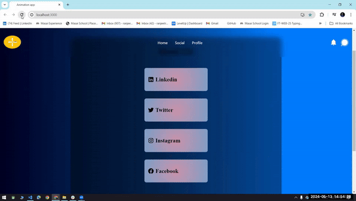
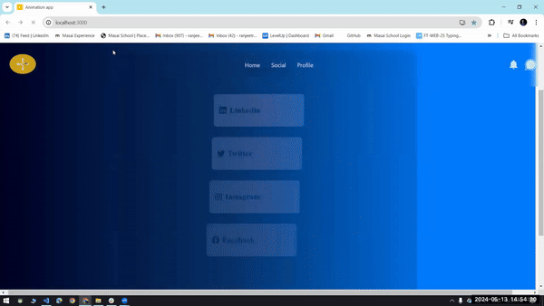
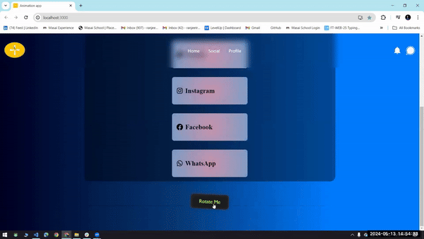
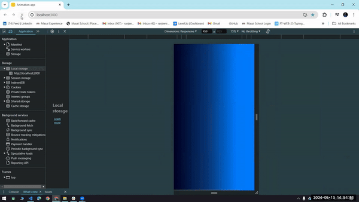
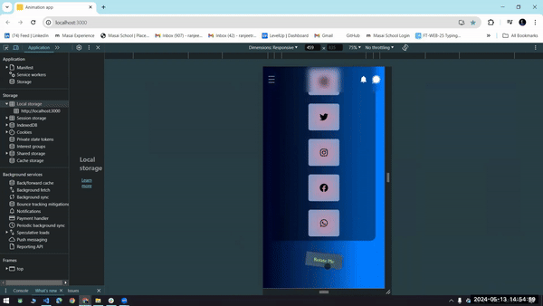

# Animation App


## Table of Contents

- [Introduction](#introduction)
- [Installation](#installation)
- [Technologies Used](#technologies-used)

## Introduction

A web app which shows different types of Animation.

## Installation

To run this application locally, follow these steps :

1. Clone this repository to your local machine :

```bash
   git  https://github.com/RanjeetRaj444/Gurucool_assignment.git
```

2. Change to the project directory :

```bash
cd Gurucool_assignment
cd my-app
```

3. Open with code editor and run the command.

```bash
npm i
```

4. Start the web page :

```bash
npm start
```

### After load first animation.



### Second Animation



### Third animation



# Mobile View




## Technologies Used

Frontend

- React
- Css
- Javascript
- HTML
- Aos animation
